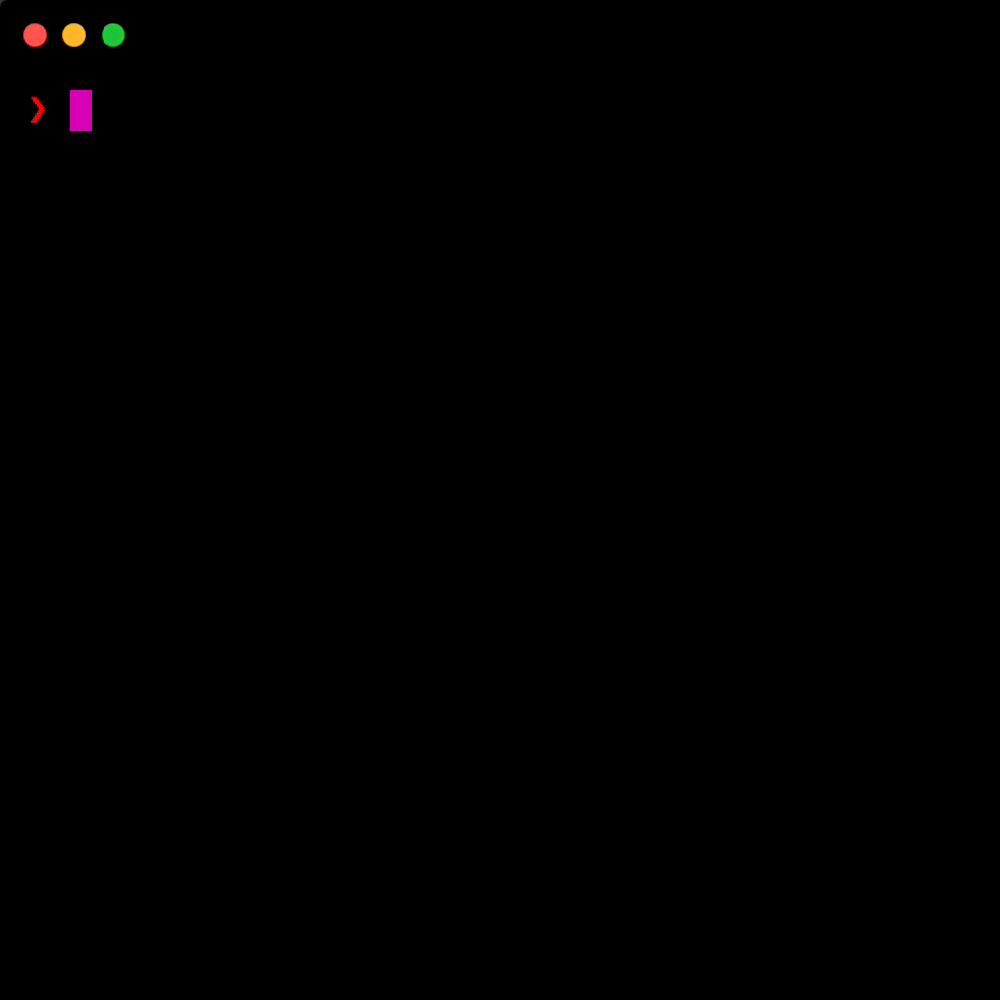

<p align="center">
  
</p>

<p align="center">:mag: A simple cli utility for querying the <code>node_modules</code> directory</p>
<p align="center">
  <a href="https://circleci.com/gh/ranyitz/qnm">
   
  </a>
  <a aria-label="NPM version" href="https://www.npmjs.com/package/qnm">
    
  </a>
  <a aria-label="License" href="https://github.com/ranyitz/qnm/blob/master/LICENSE">
    
  </a>
  <p align="center">
    
  </p>
</p>

## Why?

> most bugs are caused by the assumptions we didn't realize we were making.

When debugging a problem, I sometimes find myself checking what are the installed versions of the modules within `node_modules` directory. Current solutions like running `npm list` are not fast enough and prints too much clutter, checking the version in the `package.json` takes a bit more effort and doesn't give you more information regarding other occurrences of this module.

_qnm_ aims to get this information **fast** and tries to filter only the important parts, while supporting both yarn & npm.

## Features

*   :speech_balloon: Tab completions
*   :sparkles: Interactive fuzzy-search
*   :abc: Match all packages with a specific string
*   :interrobang: Explain why a package was installed
*   :books: Supports monorepos
*   :clock12: Show when a version was release and what is the latest version

## Installation

```bash
npm i --global qnm
```

## Usage

```bash
qnm [module]
```

For example, if you want to see the installed versions of `lodash`:

```bash
qnm lodash
```

And you'll see something like that:

```bash
lodash 4.17.21 ↰ 2 days ago
├── 4.17.21 ✓
├─┬ cli-table2
│ └── 3.10.1 ⇡ 1 year ago
└─┬ karma
  └── 3.10.1 ⇡ 1 year ago
```

Which means you have 3 occurrences of lodash in your `node_modules`:

1.  `./node_module/lodash`
2.  `./node_module/cli-table2/node_modules/lodash`
3.  `./node_module/karma/node_modules/lodash`

* The latest version of lodash is 4.17.21, it was published 2 days ago.
* The other 2 occurrences of lodash (3.10.1) were released a year ago.

### Fuzzy-search

Use `qnm` command without arguments to trigger an [`fzf`](https://github.com/junegunn/fzf) like fuzzy search.

* Start typing to filter the matches from your `node_modules`
* Use arrows to move cursor up and down
* `Enter` key to select the item, `CTRL-C` / `ESC` to exit
* `TAB` and `Shift-TAB` to mark multiple items

## Options

### --no-remote
do not fetch remote data from npm, use this if you want qnm to run faster. qnm will show limited view.

### -o , --open

Open the module's `package.json` file with the default editor.

### -d, --debug

See full error messages, mostly for debugging.

### --disable-colors

Disables the most of colors and styling. E.g. version colors.

## Commands

### list

> alias: ls

Returns a list of all modules in node_modules directory.

```bash
qnm list
```

| Optional arguments |                          Description                          |
| ------------------ | :-----------------------------------------------------------: |
| `--deps`           | List the versions of direct dependencies and devDependencies. |
| `--remote`         | Fetch remote data, this may be very slow for many packages due to many network requests |

### match

Works like grep, and match's any module that includes the supplied string.

For example, i want to see which eslint plugins i have installed:

```bash
> qnm match eslint-plug

eslint-plugin-babel
└── 3.3.0

eslint-plugin-lodash
└── 2.6.1

eslint-plugin-mocha
└── 4.12.1

eslint-plugin-react
└── 6.10.3
```

| Optional arguments |                          Description                          |
| ------------------ | :-----------------------------------------------------------: |
| `--remote`         | Fetch remote data, this may be very slow for many packages due to many network requests |

### homepage

Opens package "homepage" property in your browser. 

### install-completions

Run to install tab completions using [tabtab](https://github.com/mklabs/node-tabtab) (Setup only once)

## Contributing

Help is always welcome! Please head to the [CONTRIBUTING.md](./CONTRIBUTING.md) file to see how to get started.

## License

The MIT License
